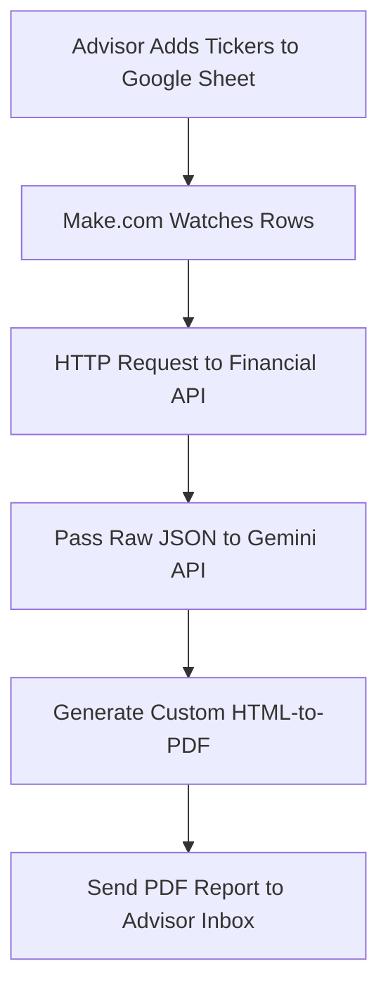

Wealth managers and financial advisors lose thousands of billable hours each quarter manually pulling ETF yields, calculating overlap, and writing customized performance summaries.

This guide provides a zero-code architecture using Make.com, a financial data API, and the Gemini API to instantly generate localized, branded PDF reports the moment you enter a list of client tickers.

---

## The Automation Architecture
Instead of logging into a terminal, copying data into Excel, and pasting it into a Word document, this pipeline handles the entire data retrieval and drafting process autonomously.



* **The Trigger:** An advisor adds a client's name and ticker symbols (e.g., `SCHD`, `DGRO`) into a Google Sheet.
* **The Data Layer:** Make.com routes the tickers to a financial API (like Alpha Vantage or Polygon.io) to retrieve current yield, 5-year dividend growth rates, and expense ratios.
* **The Analysis Engine:** The raw financial JSON is passed to the Gemini API, which applies a strict fiduciary prompt to draft a localized performance summary.
* **The Output:** The text is piped into an HTML-to-PDF module (or a Google Docs template) and emailed directly to the advisor to review before sending it to the client.

---

## Step 1: The Financial Data Fetch
In Make.com, set up a Google Sheets "Watch Rows" trigger. Connect it to an HTTP module to make a standard GET request to your financial data provider.

If your client holds standard dividend-growth exchange-traded funds, you want to query for specific metrics:
* Trailing 12-Month (TTM) Dividend Yield
* Annualized Dividend Growth Rate
* Top 10 Holdings (to check for overlap)

> [!TIP]
> **Example API Call:**
> `https://www.alphavantage.co/query?function=OVERVIEW&symbol=SCHD&apikey=YOUR_API_KEY`

---

## Step 2: The Gemini "Fiduciary" Prompt
Raw numbers mean nothing to a client. The value of an advisor is in the narrative. Pass the JSON data from your HTTP module into a Gemini API module using this strict System Prompt:

### System Prompt Template:
```text
System: You are a fiduciary wealth manager writing a quarterly portfolio review for a retail client. 

You will be provided with raw JSON data containing the dividend yield, growth rates, and top holdings of the client's ETF portfolio (e.g., the Schwab US Dividend Equity ETF and the iShares Core Dividend Growth ETF). 

Your task:
1. Write a professional, reassuring executive summary of the portfolio's income generation over the last quarter.
2. Highlight the 5-year annualized dividend growth rate to emphasize long-term compounding.
3. Identify any major sector overlap between the funds. 
4. Output the response in clean HTML format so it can be directly embedded into a PDF generation tool. 

Do not hallucinate financial advice or promise future returns. State facts based ONLY on the provided JSON.
```

---

## Step 3: PDF Generation & Delivery
Route Gemini's HTML output into Make.com’s built-in PDF Generator (or a tool like PDFMonkey).
Map the client’s name and your firm’s logo URL into the header. Finally, use the **Gmail -> Send Email** module to automatically route the finished PDF to your inbox.

By building this exact flow, an advisory firm can turn a grueling three-week quarterly reporting period into a background process that runs in **45 seconds**.

---

## Step 4: Scale and Deploy
Once you have tested the scenario in sandbox mode, you can activate the scheduling in Make.com. Most wealth management firms run this weekly or monthly to keep client-facing materials updated automatically.

---

### Need Custom Implementations?
Don't have the internal engineering bandwidth to configure API pipelines, secure database keys, and set up PDF generators? 

Our team at **Neutral Overdrive** builds custom, secure financial automation workspaces for wealth management firms. We handle everything from pipeline architecture to enterprise security.

👉 [**Inquire about custom automation consulting**](/advertise)
