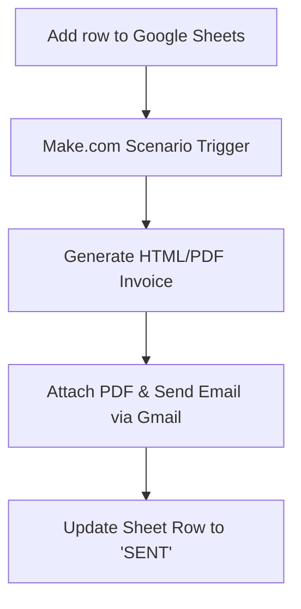

Manual invoicing is one of the biggest time-wasters for freelancers, agencies, and small business owners. If you are copying data from client logs into document templates, exporting PDFs, and manually drafting emails, you are losing billable hours every week.

This guide walk you through how to build a **fully automated invoicing pipeline** using Google Sheets, Gmail, and Make.com. Once set up, adding a single row to a spreadsheet will automatically generate a professional invoice PDF and email it directly to your client.

To follow this tutorial, you will need a free account on Make:
> **Signup Link:** [Create your free account on Make.com](https://www.make.com/en/register?pc=neutraloverdrive)

---

## The Workflow Architecture
Before we dive into setup, here is how the data will flow through the automation:



---

## Step 1: Set Up Your Google Sheet
Create a new Google Sheet and title it `Client Invoices`. Add the following headers in row 1:

| Column | Header Name | Description |
|---|---|---|
| **A** | `Invoice ID` | A unique number (e.g., INV-1001) |
| **B** | `Client Name` | Name of the recipient |
| **C** | `Client Email` | Destination email address |
| **D** | `Amount` | Cost of services (e.g., 1500) |
| **E** | `Status` | Keep empty (the bot will write "SENT" here) |

---

## Step 2: Configure the Make.com Scenario
Log in to your [Make.com Dashboard](https://www.make.com/en/register?pc=neutraloverdrive) and click **Create a new scenario**. 

### 1. Google Sheets Module (Trigger)
*   Add a new module and select **Google Sheets** -> **Watch Rows**.
*   Connect your Google Account.
*   Select your spreadsheet `Client Invoices` and set the Limit to `1` (this ensures rows are processed sequentially).

### 2. Router & Filter (Optional but Recommended)
*   Add a filter between the Google Sheet trigger and the next module.
*   Set the filter condition to: *Only proceed if `Status` does not equal `SENT`*. This prevents the bot from emailing the same client multiple times.

---

## Step 3: Generate the Invoice PDF
We will use HTML to construct a clean invoice and convert it to a PDF:

*   Add a module and select **Tools** -> **Text Aggregator** or **HTML-to-PDF** converter.
*   Paste a basic invoice template. You can map variables directly from your Google Sheet columns by clicking on them:

```html
<div style="font-family: Arial; padding: 20px;">
  <h2>INVOICE</h2>
  <p><strong>Invoice ID:</strong> {{1.Invoice ID}}</p>
  <p><strong>To:</strong> {{1.Client Name}}</p>
  <hr/>
  <h3>Total Due: ${{1.Amount}}</h3>
</div>
```

---

## Step 4: Automate the Email Delivery via Gmail
Now, let's deliver the document:

*   Add a new module and select **Gmail** -> **Send an Email**.
*   Connect your Gmail account.
*   In the **To** field, select the `Client Email` variable from the Google Sheets module.
*   In the **Attachments** field, select the output file from the PDF generator step.
*   Draft your message body:
    > *"Hi {{1.Client Name}},\n\nPlease find attached your invoice {{1.Invoice ID}} for ${{1.Amount}}.\n\nBest,\nEditorial Team"*

---

## Step 5: Close the Loop (Update Google Sheets)
Finally, we want the automation to tag the row as finished:

*   Add a final **Google Sheets** -> **Update a Row** module.
*   Choose the same sheet. Set the Row Number to match the row from the Trigger module.
*   Change the **Status** column value to **`SENT`**.

Click **Run Once** in Make to test it, and then toggle the scenario to **Active** to let it run in the background!
