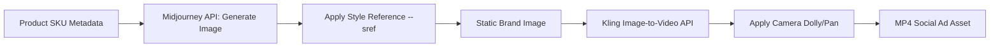

As digital marketing shifts toward hyper-personalized, localized campaigns, the manual creation of advertising assets has become a massive production bottleneck. Having designers prompt and edit individual product shots, only to manually drop them into video models, limits your output to a handful of variations per week.

To scale creative asset production, marketing engineering teams are building **programmatic image-to-video pipelines**. 

This guide provides a blueprint for a fully automated content pipeline: generating consistent product images with Midjourney (using brand style parameters), feeding those outputs into the Kling AI API, and exporting short-form social video ads.

---

## The Pipeline Architecture
In this pipeline, a single product SKU metadata record translates into a complete video ad without human design intervention:



[[AdUnit: in-article-banner]]

---

## Step 1: Ensuring Midjourney Consistency
Programmatic generation risks outputting wild stylistic deviations. To maintain brand guidelines, your Midjourney prompts must use specific scaling parameters:
*   **Style Reference (`--sref`):** Passes a URL of a pre-approved brand style guide image to force the AI to respect color palettes, lighting, and textures.
*   **Constant Styling Prompts:** Lock in camera specs (`commercial studio lighting`, `shot on 85mm lens`, `minimalist solid background`).
*   **Image Prompts:** Use a flat-lay cutout of the raw product container to ensure the brand's actual packaging shape is preserved.

---

## Step 2: The Programmatic Coordinator
Below is a complete Python pipeline script. It generates a product shot, monitors the progress, and passes the output directly into the Kling Image-to-Video API with camera movement instructions:

```python
import time
import requests
from typing import Dict, Any

# Configuration settings
MIDJOURNEY_API_URL = "https://api.midjourney-wrapper.com/v1"
KLING_API_URL = "https://api.klingai.com/v1"
HEADERS_MJ = {"Authorization": "Bearer MJ_API_KEY"}
HEADERS_KLING = {"Authorization": "Bearer KLING_API_KEY"}

def generate_product_image(product_name: str, style_url: str) -> str:
    # 1. Formulate consistent prompt using Style Reference
    prompt = (
        f"A premium glass bottle of {product_name} perfume, "
        f"resting on a wet marble surface, studio lighting, soft reflections, "
        f"--sref {style_url} --v 6.0 --ar 16:9"
    )
    
    # 2. Dispatch Midjourney Job
    response = requests.post(
        f"{MIDJOURNEY_API_URL}/imagine", 
        json={"prompt": prompt}, 
        headers=HEADERS_MJ
    )
    job_id = response.json()["job_id"]
    
    # 3. Poll for Midjourney compilation
    while True:
        status_res = requests.get(f"{MIDJOURNEY_API_URL}/jobs/{job_id}", headers=HEADERS_MJ).json()
        if status_res["status"] == "completed":
            return status_res["image_url"]  # Return public image URL
        elif status_res["status"] == "failed":
            raise Exception("Midjourney image generation failed")
        time.sleep(5)

def generate_video_ad(image_url: str, product_name: str) -> str:
    # 1. Dispatch Kling Image-to-Video request
    payload = {
        "model": "kling-v1.5",
        "image_input": image_url,
        "prompt": f"Professional advertising video showing the {product_name} perfume bottle, camera slowly zooming in with subtle water rippling in the background",
        "aspect_ratio": "16:9",
        "camera_movement": {
            "type": "dolly_in",
            "zoom_factor": 1.2
        },
        "motion_sensitivity": 4
    }
    
    response = requests.post(
        f"{KLING_API_URL}/videos/image-to-video", 
        json=payload, 
        headers=HEADERS_KLING
    )
    task_id = response.json()["task_id"]
    
    # 2. Poll Kling API for final MP4 file
    while True:
        status_res = requests.get(f"{KLING_API_URL}/tasks/{task_id}", headers=HEADERS_KLING).json()
        if status_res["status"] == "success":
            return status_res["video_url"]
        elif status_res["status"] == "failed":
            raise Exception("Kling video generation failed")
        time.sleep(10)

# Execute the pipeline
if __name__ == "__main__":
    brand_style = "https://mybrand.com/images/style-guide-preset.jpg"
    product = "Elysian Noir"
    
    print(f"Starting pipeline for: {product}...")
    try:
        static_img = generate_product_image(product, brand_style)
        print(f"Midjourney Image generated: {static_img}")
        
        video_ad = generate_video_ad(static_img, product)
        print(f"Kling Video Ad generated successfully! Live asset path: {video_ad}")
    except Exception as e:
        print(f"Pipeline error occurred: {e}")
```

[[PromptCard: main]]

---

## Step 3: Resolving Image-to-Video Physics Issues
Converting static images to video programmatically can result in visual inconsistencies:
1.  **Motion Sensitivity Tuning:** For product ads, keep Kling's motion sensitivity configuration at a low-to-mid range (`3` to `5`). High sensitivity causes labels, text, and physical bottle geometry to morph surrealistically.
2.  **Strict Camera Instructions:** Rely on camera movement parameters (`dolly_in`, `pan_right`) rather than free-form text descriptors. Instructing the camera explicitly minimizes unwanted warping of the product's packaging details.
3.  **Frame Boundaries:** Keep the subject centered in Midjourney. If a product edges close to the frame boundary, Kling's panning motion can result in background clipping artifacts.

By running this automated coordinator script, developers can link inventory management systems directly to marketing channels, dynamically spawning video variations as new product SKUs are uploaded to the catalog.
