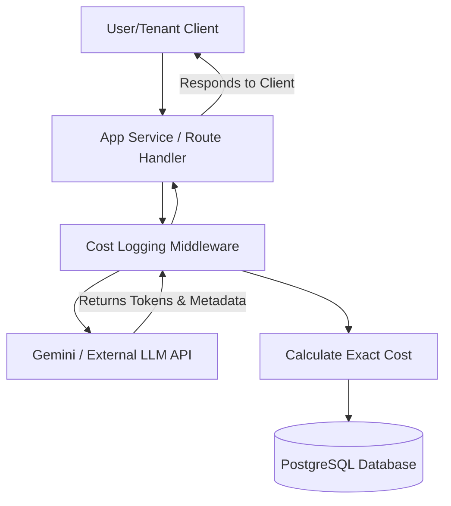

As SaaS platforms integrate generative features, the biggest infrastructure headache is **cost attribution**. 

If your multi-tenant application routes all user queries through a single Gemini or OpenAI API key, your monthly provider bill is aggregated. You cannot easily map that $5,000 invoice back to specific customers, departments, or individual pricing tiers. If one tenant runs a massive, unoptimized agent loop, they can wipe out their subscription margin in hours.

To protect your margins, you must implement an outbound API middleware that intercepts model responses, extracts raw token counts, and logs calculated costs to a database. 

This guide provides a blueprint for a **Multi-Tenant API Cost Allocation** engine using a PostgreSQL schema and a Node.js/Express middleware handler.

---

## The System Architecture
Rather than calling the LLM API directly from your application services, all requests route through a logging wrapper:



[[AdUnit: in-article-banner]]

---

## Step 1: The PostgreSQL Billing Schema
First, we need a relational model to store tenant definitions, active model pricing (the "rate card"), and individual execution records:

```sql
-- 1. Tenants Table
CREATE TABLE tenants (
    id UUID PRIMARY KEY DEFAULT gen_random_uuid(),
    name VARCHAR(255) NOT NULL,
    monthly_budget NUMERIC(10, 4) DEFAULT 100.00,
    created_at TIMESTAMP WITH TIME ZONE DEFAULT NOW()
);

-- 2. Model Pricing Rate Card (Costs per 1,000,000 tokens)
CREATE TABLE model_rates (
    id VARCHAR(100) PRIMARY KEY, -- e.g., 'gemini-3.1-pro'
    input_rate_per_million NUMERIC(10, 4) NOT NULL,
    output_rate_per_million NUMERIC(10, 4) NOT NULL,
    updated_at TIMESTAMP WITH TIME ZONE DEFAULT NOW()
);

-- Populate with standard Gemini pricing
INSERT INTO model_rates (id, input_rate_per_million, output_rate_per_million)
VALUES 
    ('gemini-3-flash', 0.50, 3.00),
    ('gemini-3.1-pro', 2.00, 12.00);

-- 3. API Consumption Log Table
CREATE TABLE api_token_logs (
    id UUID PRIMARY KEY DEFAULT gen_random_uuid(),
    tenant_id UUID REFERENCES tenants(id) ON DELETE CASCADE,
    model_id VARCHAR(100) REFERENCES model_rates(id),
    prompt_tokens INT NOT NULL,
    completion_tokens INT NOT NULL,
    calculated_cost NUMERIC(12, 6) NOT NULL,
    created_at TIMESTAMP WITH TIME ZONE DEFAULT NOW()
);

-- Create index for fast aggregate tenant queries
CREATE INDEX idx_logs_tenant_date ON api_token_logs(tenant_id, created_at);
```

---

## Step 2: The Interceptor Middleware (Node.js)
Below is the Express middleware handler that wraps your API wrapper. It captures the token counts returned in Gemini's `usageMetadata` object, calculates the pricing dynamically against your database rate card, and writes the log:

```javascript
import { GoogleGenAI } from '@google/genai';
import { Pool } from 'pg';

const db = new Pool({ connectionString: process.env.DATABASE_URL });
const ai = new GoogleGenAI({ apiKey: process.env.GEMINI_API_KEY });

// Express Middleware for wrapping LLM calls and logging costs
export async function handleTenantLLMCall(req, res, next) {
  const tenantId = req.headers['x-tenant-id'];
  const { model, prompt } = req.body;

  if (!tenantId) {
    return res.status(400).json({ error: 'Missing tenant identifier headers.' });
  }

  try {
    // 1. Fetch Model Pricing from Database Rate Card
    const rateCardQuery = await db.query(
      'SELECT input_rate_per_million, output_rate_per_million FROM model_rates WHERE id = $1',
      [model]
    );

    if (rateCardQuery.rowCount === 0) {
      return res.status(400).json({ error: `Model ${model} is not supported in the billing engine.` });
    }

    const { input_rate_per_million, output_rate_per_million } = rateCardQuery.rows[0];

    // 2. Call the Gemini API
    const response = await ai.models.generateContent({
      model: model,
      contents: prompt,
    });

    // 3. Extract usage metadata
    const usage = response.usageMetadata;
    const promptTokens = usage.promptTokenCount || 0;
    const completionTokens = usage.candidatesTokenCount || 0;

    // 4. Calculate actual cost: (Tokens / 1M) * Rate
    const costInput = (promptTokens / 1000000) * Number(input_rate_per_million);
    const costOutput = (completionTokens / 1000000) * Number(output_rate_per_million);
    const totalCost = costInput + costOutput;

    // 5. Write to DB asynchronously to avoid blocking user response
    db.query(
      `INSERT INTO api_token_logs (tenant_id, model_id, prompt_tokens, completion_tokens, calculated_cost)
       VALUES ($1, $2, $3, $4, $5)`,
      [tenantId, model, promptTokens, completionTokens, totalCost]
    ).catch(err => console.error('Token logging failed async:', err));

    // 6. Return response to consumer
    return res.json({
      text: response.text,
      usage: {
        promptTokens,
        completionTokens,
        totalCostUSD: totalCost.toFixed(6)
      }
    });

  } catch (error) {
    console.error('LLM proxy routing exception:', error);
    return res.status(500).json({ error: 'Internal API routing failure.' });
  }
}
```

[[PromptCard: main]]

---

## Step 3: Production Scale Considerations
As your platform scales to millions of daily API transactions, direct database writes on every middleware call will cause write locks and database latency:

1.  **Asynchronous Message Queues:** In high-volume setups, do not write to PostgreSQL inside the middleware thread. Instead, publish the billing payload to a Redis queue or RabbitMQ broker, letting a background worker batch-write logs in bulk every 10 seconds.
2.  **Budget Guardrails:** Add a pre-execution check to verify that a tenant's aggregate monthly consumption cost does not exceed their budget (`monthly_budget`). If the tenant is over limit, reject the request with `HTTP 402 Payment Required` before calling the external API.
3.  **Cache the Rate Card:** Avoid querying the `model_rates` table on every query. Cache model pricing in Redis with a 24-hour expiration window since provider token rates change infrequently.

By establishing this data logging structure, you can verify exactly where your LLM spending is going, adjust tenant pricing models accurately, and ensure your SaaS operations remain profitable.
